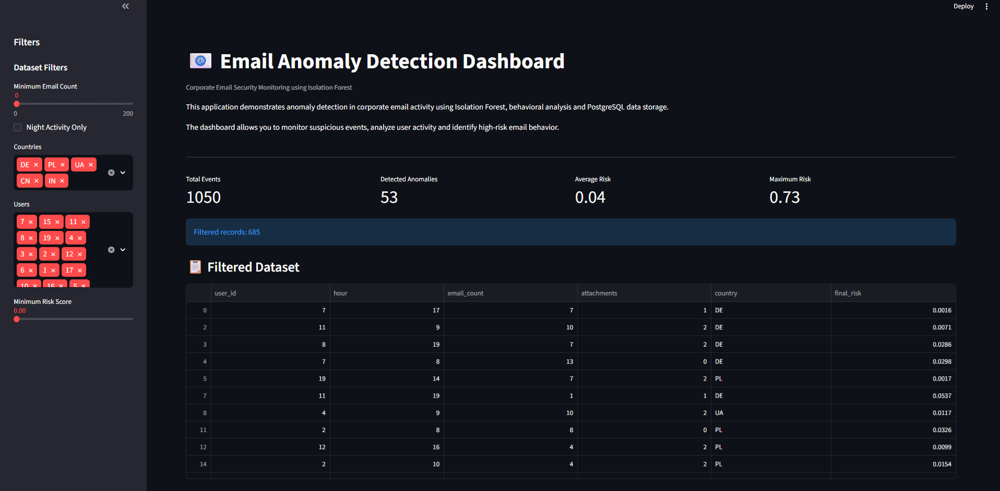
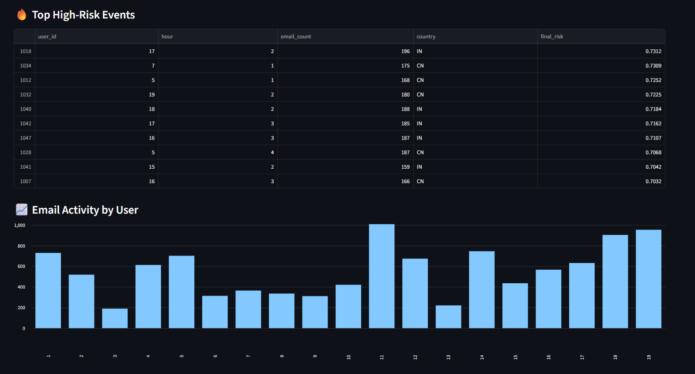
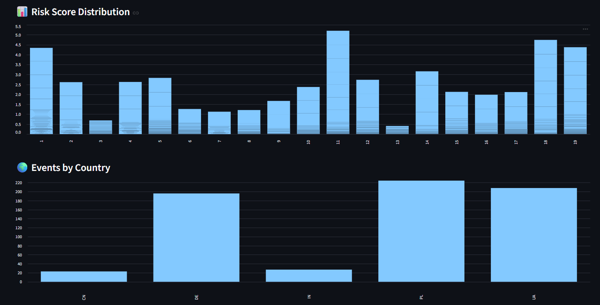
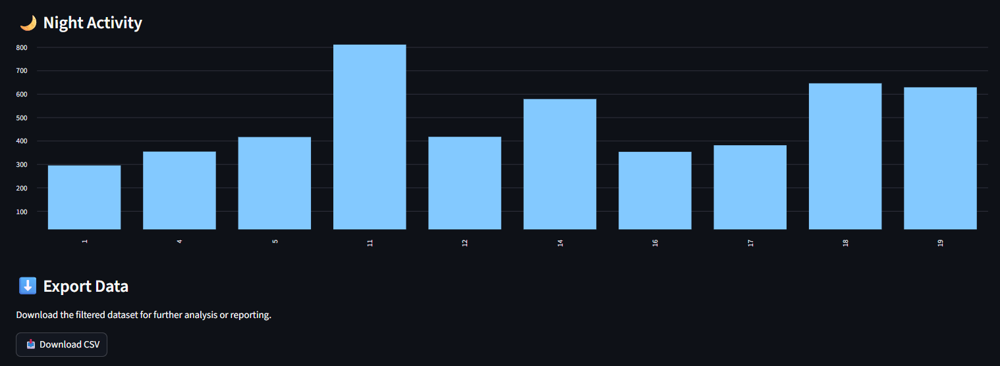

# 📧 Email Anomaly Detection System

Machine Learning project for detecting anomalous corporate email activity using behavioral analysis and Isolation Forest.

---

## Overview

This project demonstrates an end-to-end security analytics workflow for identifying suspicious email activity.

The application generates synthetic email logs, applies machine learning to detect anomalies, calculates a risk score for each event and visualizes the results using an interactive Streamlit dashboard.

---

## Features

- Synthetic email activity generation
- Data preprocessing
- Isolation Forest anomaly detection
- Behavioral analysis
- Risk scoring
- PostgreSQL integration
- Interactive Streamlit dashboard
- CSV export

---

## Technologies

- Python
- Pandas
- NumPy
- Scikit-learn
- PostgreSQL
- SQLAlchemy
- Streamlit

---

## Workflow

Email Activity

↓

Data Preprocessing

↓

Isolation Forest

↓

Behavior Analysis

↓

Risk Scoring

↓

PostgreSQL

↓

Streamlit Dashboard

---

## Dashboard

The dashboard includes:

- Event monitoring
- Risk score visualization
- Country analysis
- User activity analysis
- Night activity monitoring
- CSV export

---

## Project Structure

```
email-anomaly-detector/

app/
    streamlit_app.py

src/
    main.py
```

---

## Installation

```bash
git clone https://github.com/DataMontreval/email-anomaly-detector.git

cd email-anomaly-detector
```

Install dependencies

```bash
pip install -r requirements.txt
```

Run data generation

```bash
python src/main.py
```

Launch dashboard

```bash
streamlit run app/streamlit_app.py
```

---

## Skills Demonstrated

- Machine Learning
- Data Analysis
- Behavioral Analytics
- Risk Assessment
- Data Visualization
- Dashboard Development
- SQL
- Python

---

## Future Improvements

- Real-time monitoring
- REST API
- Authentication
- Docker deployment
- Cloud database
- Live email ingestion

---

# Dashboard Preview

## Main Dashboard

The main dashboard provides an overview of the email security monitoring system, including key metrics, filtering options and detected anomalies.



---

## Risk Monitoring

The system identifies the highest-risk events and visualizes the distribution of risk scores to help prioritize security investigations.





---

## Activity Analytics

The dashboard also provides behavioral analytics, including email activity by user, country distribution and night-time activity monitoring.



## Author

**Dmytro Dimura**

LinkedIn: www.linkedin.com/in/dmytro-dimura


